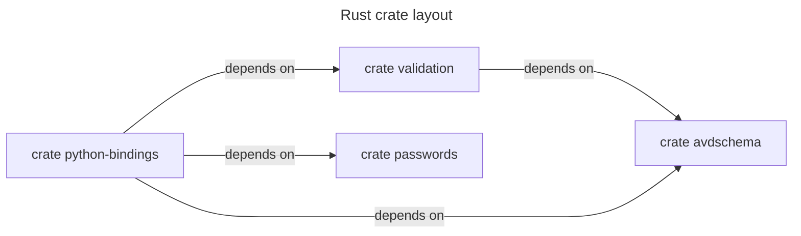

<!--
  ~ Copyright (c) 2025-2026 Arista Networks, Inc.
  ~ Use of this source code is governed by the Apache License 2.0
  ~ that can be found in the LICENSE file.
  -->



## Lean avdschema features

`avdschema` always includes the regular-expression functionality required by
existing AVD schemas: Unicode Perl classes (`\d`, `\s`, and `\w`) and
variable-length lookbehinds. Its default features enable native performance
accelerators, gzip loading, and YAML file support. Full Unicode properties and
scripts are intentionally unsupported, so patterns such as `\p{Greek}` are
rejected.

WASM or other size-sensitive applications consuming an uncompressed JSON
schema can omit the performance accelerators, gzip, and YAML while retaining
the schema-required syntax:

```toml
avdschema = { version = "0.0.7", default-features = false }

validation = { version = "0.0.7", default-features = false }

yaml-parser = { version = "0.0.7", default-features = false, features = ["avdschema-core"] }
```

The existing `yaml-parser` feature named `avdschema` retains the default
`avdschema` feature set, including performance accelerators, gzip, and YAML.
Use `avdschema-core` for the lean path. Unicode Perl classes and variable
lookbehinds are always enabled.
