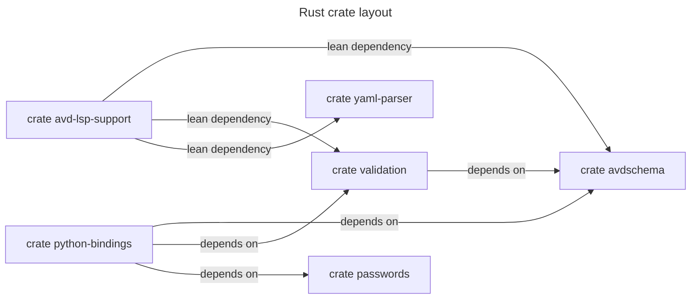

<!--
  ~ Copyright (c) 2025-2026 Arista Networks, Inc.
  ~ Use of this source code is governed by the Apache License 2.0
  ~ that can be found in the LICENSE file.
  -->



## Lean avdschema features

AVD schemas use a deliberately restricted regular-expression dialect.
`avdschema` supports Unicode-aware Perl classes (`\d`, `\s`, and `\w`, including
their uppercase complements), Unicode-safe wildcards and explicit character
classes, lookarounds, and variable-length lookbehinds. Broader Unicode
properties and scripts such as `\p{Greek}` are intentionally unsupported.
Patterns are matched against the complete value. The default features
additionally enable native performance accelerators, gzip loading, and YAML file
support.

The AVD language server consumes these crates through `avd-lsp-support`. That
crate exposes the exact schema, validation, and YAML parser API used by the LSP
and owns its lean feature selection:

```toml
avd-lsp-support = { version = "0.0.8", default-features = false }
```

Native LSP consumers can enable its `gzip` feature when needed. The browser
WASM build should retain the empty default feature set.

The existing `yaml-parser` feature named `avdschema` retains the default
`avdschema` feature set, including performance accelerators, gzip, and YAML.
Use `avdschema-core` for the lean path. Unicode-aware Perl classes and
variable-length lookbehinds are always enabled.

## Benchmarks

Run the Criterion-compatible benchmark suites locally from the repository root:

```bash
cargo bench --locked --workspace --all-features
```

CodSpeed uses simulation and memory analysis builds. The measurement modes must
be present when the benchmark binaries are built so the required instrumentation
is included:

```bash
cargo install cargo-codspeed --version 5.0.1 --locked
cargo codspeed build --locked --workspace --all-features --measurement-mode simulation,memory
cargo codspeed run --workspace
```

Simulation is the current name for the mode formerly called instrumentation.
The GitHub workflow uploads both simulation and memory measurements after the
Rust test matrix succeeds.
